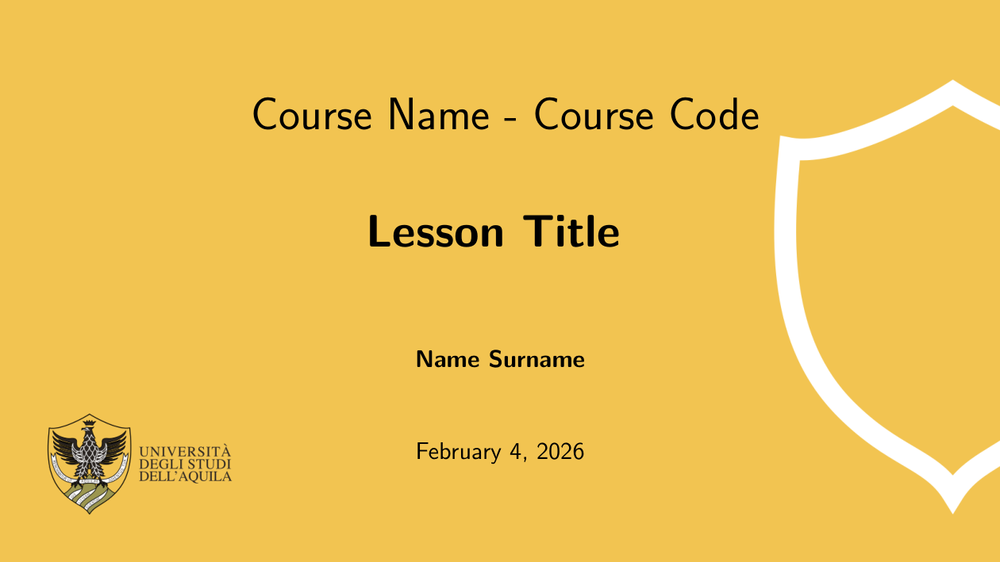
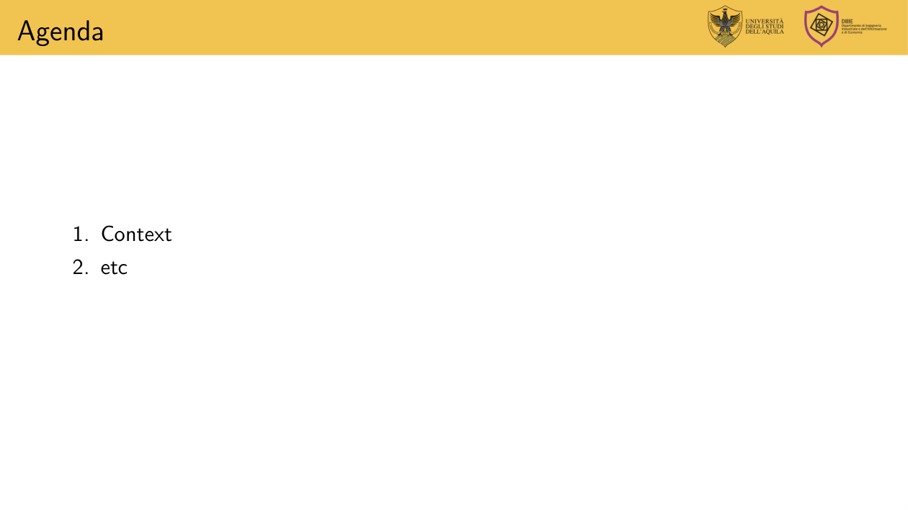
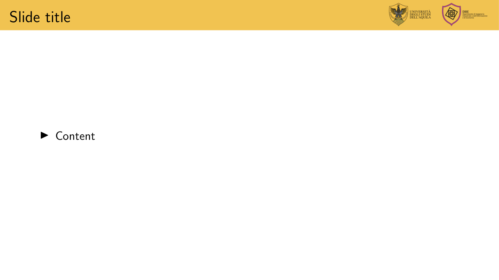
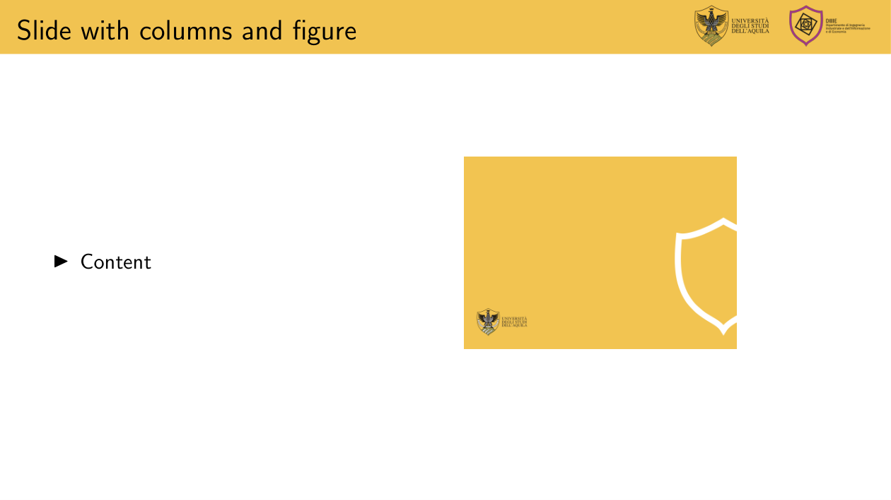

# Template for Univaq DIIIE department

An **unofficial LaTeX Beamer template**.

This repository contains a set of **academic presentation slides** prepared using LaTeX Beamer.

## Screenshots

### Title page


### Content overview


### Main content


### Additional content


### Section slide


### Final slide


## Compilation

The slides can be compiled using:

```bash
pdflatex main.tex
```

## Notes

All material is intended for **public academic dissemination**.
